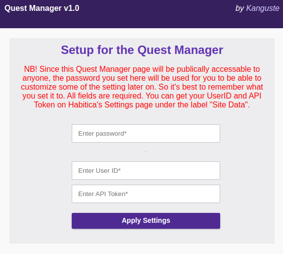
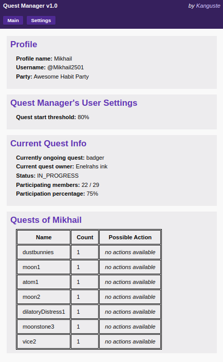
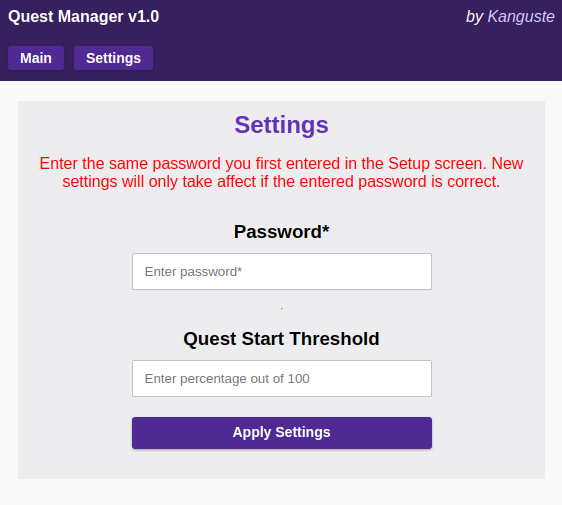

# Habitica Quest Manager v1.0

*scroll down to the (Installation)[#installation] section for setup instructions*

This is a **Google App's Script** integrating with Habitica. It allows your party members to send invitations for, and start quests from, your inventory. It requires only a single deploy, and doesn't require the user to change anything manually in the code. All the settings are available in the UI of the deployed page. Once the script is deployed, the user can simply enter their UserID and ApiToken into the form on the Setup page of the Deployed website, then share the URL with their party. It's that simple! 

## Features
- **Send invitations and start quests**
- **View current quest information**
- **View the user's quest inventory**
- **Secure authentication**
- **Settings page for extra tweaks**
- **Extra actions for Party Leaders**

## Preview Images

Setup | Main | Settings | 
:-:|:-:|:-:
 |  | 

## Installation
You will need to be logged into a Google Account for this to work

1. Go to the following link: https://script.google.com/d/1oqbHiWau8VjYdYjeAqtsX2JpAatS8m9HvNm0tOPtvXSj6N7xgmgGVpX_/edit?usp=sharing
2. In the "Overview" tab, press the button that says "Make a copy"
3. Once a copy of the script opens, rename it whatever you want
4. On the top-right, press the blue button that says "Deploy"
5. From the opened dropdown menu, select "New deployment"
6. Next to the "Select type", there is a gear icon. Press it, and make sure that only the "Web app" option is selected
7. Fill in the fields: Description can be anything, you can just name is "Quest Manager" for simplicity
8. Make sure the "Execute as" is your mail Google Accout (most-likely the one you registered yourself to Habitica)
9. "Who has access" must be set to Anyone. 
10. Press the button "Deploy" and wait patiently for it to load. 
11. Once the loading is done, press the blue button "Authorize access"
12. It may ask you to choose a Google account, in which case you should choose the same one you chose in the "Execute as" section
13. If Google says "Google hasn't verified this app", then just press "Advanced" at the bottom of this message and then select the option "Go to... *whatever you named the script* (unsafe)"
14. If asked, press "Allow"
15. You should be redirected back to the Script Deployment page, where it shows a "Web app URL" with a link
16. Press the "COPY" button below this link to copy it. 
17. Paste the link into the browser's address bar, and hit enter
18. If everything done correctly, you should see the Quest Manager's website with a Setup form
19. Follow the instructions on that page to set up the Quest Manager
20. Once the setup is done, share the same link you just copied with your party members. Woohoo! :) 

I would appreciate it a lot if anyone has a moment to try this out and give some feedback on how the instructions are to follow <3
