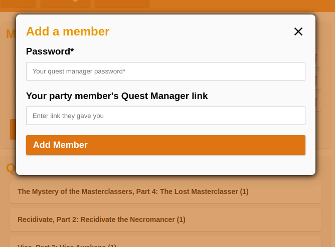

# Awesome Quest Manager

Manage your entire party's quests, all from a single page! 

> ***NB!** The UserID and ApiToken are stored in the PropertiesService of the Google Apps Script, which means that ONLY YOU will have access to them when they are entered into the Setup form of the Quest Manager. You should NEVER enter your UserID and ApiToken on a Quest Manager that anyone else other than yourself has Deployed.*

This is a **Google Apps Script** integrating with [Habitica](https://habitica.com/). Once set up, it allows your party members to send invitations for, and start quests from, your inventory. It requires only a single deploy, and doesn't require the user to change anything manually in the code. All the settings are available in the UI of the deployed page. Once the script is deployed, the user can simply enter their UserID and ApiToken into the form on the Setup page of the Deployed website, then share the URL of the page with their party. It's that simple! 

- *Scroll down to the [Installation](#installation) section for setup instructions.*
- *If you want to contrubute to the project, head over to the [For Developers](#for-developers) section.*

## Current features (v1.4)
- **Secure setup Page and authentication**
- **View the user's quest inventory**
- **Send invitations and start quests**
- **See the current quest in progress**
- **View information about every quest**
- **Extra actions for Party Leaders**
- **Settings Page:** for other tweaks
- **Members Page:** where you can connect other party memebrs' Quest Managers to your own, and therefore manage your entire party's quest inventory just from one page. 

## Upcoming in next release (v1.5)
- **Auto accept:** A setting to automatically join a quest once invitations for it have been sent out
- **Notifications:** Notify the user on Habitica whenever someone has started a quest through their Quest Manager

## Upcoming in future releases
- **Auto start quest:** Start a quest automatically either when enough members have joined, or enough time has passed by
- **Voting system:** Where party members can vote for which quest they want to be started next
- **Quest queue:** Setup a list of quests that will be started automatically in order by the system

## Preview Images (v1.4)

Members | Invite | Add | 
:-:|:-:|:-:
 |  | 

## Installation
You will need to be logged into a Google Account for this to work. The following steps are intended to be executed on a computer, not on a phone. 

1. Go to the following link for installing **v1.4**: https://script.google.com/d/1tklrjBgpTfH7JAEqlShfx7PF1PckavO3lkhApN9tCGogxEmGK0SAgGag/edit?usp=sharing
2. In the "Overview" tab, press the button that says "Make a copy"
3. Once a copy of the script opens, rename it whatever you want
4. On the top-right, press the blue button that says "Deploy"
5. From the opened dropdown menu, select "New deployment"
6. Next to the "Select type", there is a gear icon. Press it, and make sure that only the "Web app" option is selected
7. Fill in the fields: Description can be anything, you can just name is "Quest Manager" for simplicity
8. Make sure the "Execute as" is your mail Google Accout (most-likely the one you registered yourself to Habitica)
9. "Who has access" must be set to Anyone. 
10. Press the button "Deploy" and wait patiently for it to load. 
11. Once the loading is done, press the blue button "Authorize access"
12. It may ask you to choose a Google account, in which case you should choose the same one you chose in the "Execute as" section
13. If Google says "Google hasn't verified this app", then just press "Advanced" at the bottom of this message and then select the option "Go to... *whatever you named the script* (unsafe)"
14. If asked, press "Allow"
15. You should be redirected back to the Script Deployment page, where it shows a "Web app URL" with a link
16. Press the "COPY" button below this link to copy it. 
17. Paste the link into the browser's address bar, and hit enter
18. If everything done correctly, you should see the Quest Manager's website with a Setup form
19. Follow the instructions on that page to set up the Quest Manager
20. Once the setup is done, share the same link you just copied with your party members. Woohoo! :) 

If the instructions happen to be difficult to follow, anyone is very welcome to either create an Issue or a Pull Request on this GitHub repository :) 

## For Developers
Hello devs! The Google Apps Script(GAS) project is written in TypeScript using ES6 modules. For deploying, we convert the TypeScript over to JavaScript and then remove all imports/exports (since GAS doesn't support them). The tools used for this process are TypeScript compiler (tsc) and Gulp. An easy to use command for building and pushing the generated files over to GAS is `npm run push`. 

### Simple setup
> Make sure you have the following tools: git, npm, clasp

1. Perform a `git clone`
2. Install packages with `npm i`
3. Go to [script.google.com](script.google.com) and create a new Google Apps Script project
4. Place the ID of the created project into the `clasp.json` file under the `scriptId` field. 
5. Change the `rootDir` in `clasp.json` according to the project location on your computer
6. Compile and push the project to GAS with `npm run push`

Now you are free to change any code, build the project, and push it to Google's servers. Woohoo! :) 
